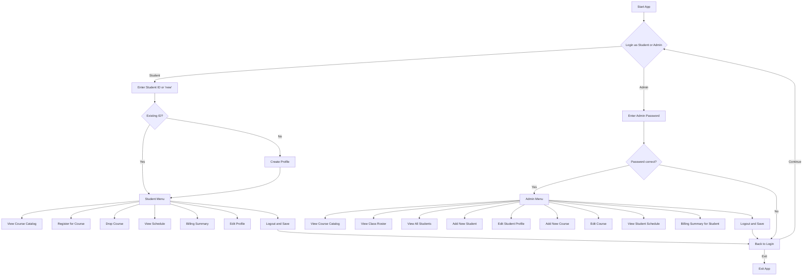

# unknownapp
This is an unknown application written in Java

---- For Submission (you must fill in the information below) ----
### Use Case Diagram
])

### Flowchart of the main workflow

### Prompts
"I select the use case "Create New student Profile", so your task is to create an equivalent Python version of the program. Put the Python program in a new folder called “python.”, Note that I want only "create new student profile" function. Do not include other funtionalities"
